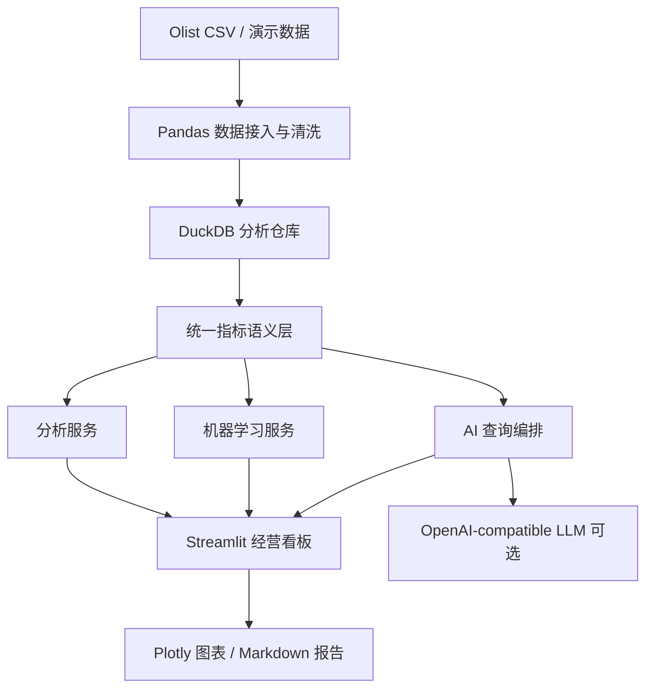
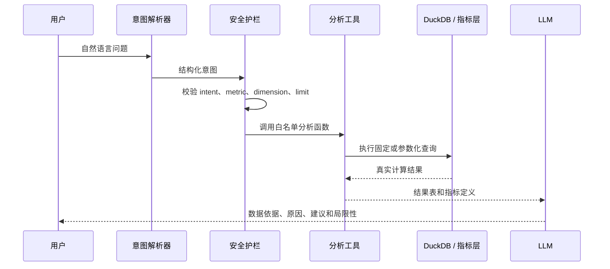

# 项目架构

## 总体设计

项目采用模块化单体架构，适合个人开发和求职演示：



## 模块职责

| 模块 | 主要职责 |
|---|---|
| `data_pipeline` | 读取标准 Olist CSV、清洗时间和金额字段、构建订单分析宽表 |
| `warehouse` | 提供 DuckDB 只读连接，阻止展示层直接修改分析库 |
| `metrics` | 集中维护订单量、支付金额、延迟率等指标口径 |
| `analytics` | 提供看板和 AI 助手共用的可复用分析函数 |
| `ml` | 构造不泄漏的延迟预测特征、训练和评估模型 |
| `ai` | 解析意图、校验白名单、调用分析工具、生成证据型解释 |
| `app.py` | 组合页面、筛选器、图表、模型和 AI 功能 |

## AI 查询流程



## 机器学习流程

```text
订单早期信息
  → 特征工程
  → 训练集/测试集
  → Logistic Regression 基线
  → Precision / Recall / F1 / ROC-AUC
  → 风险概率
```

模型不使用以下字段：

- 实际送达时间；
- 评价分数；
- 最终履约状态；
- 延迟标签本身。

## 为什么选择模块化单体

- 一个 Streamlit 应用即可完成演示；
- DuckDB 不需要额外数据库服务；
- 每个业务能力都可以被测试；
- AI、模型和传统分析共享同一指标层；
- 代码结构足够清晰，但不会过度工程化。

## 数据粒度

项目同时维护订单粒度 mart_order_analysis 和商品明细粒度 fact_order_items。订单量、延迟率和模型使用订单粒度；品类、卖家销售额使用商品明细粒度，避免多卖家/多品类订单被归给第一条明细。

真实数据与演示数据使用不同目录和不同 DuckDB 文件，建仓时保存源文件 SHA-256 指纹。
